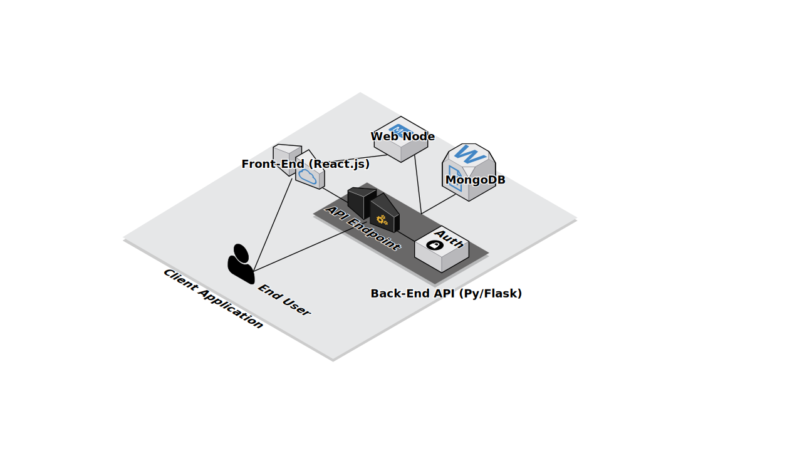
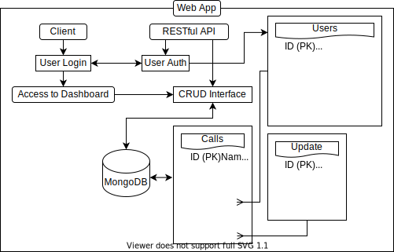

[:rewind: Back](/README.md)

# :two: Design

- [Infrastructure](#infrastructure)
- [Database](#database)
- [Top Down Diagram](#top-down-diagram)
- [Chosen Tech Stack](#chosen-technology-stack)
	- [Backend](#backend)
	- [Databases](#databases)
	- [Frontend](#frontend)
	- [Deployment](#deployment)
	- [Devops](#devops)
	- [Tools](#tools)

# Infrastructure

We need somewhere to run our application, and it must be ran in a secure fashion, under a defined infrastructure. This will help to manage, deploy, and explain the inner workings of the application to our clients.

- **Web Node**

The application will run under 1 web node which will be split between two parallel running applications.

- **Front-End**

Utilising React.JS, the front end will provide the end-user with an interface and experience, allowing them to interact with the data that they manage.

- **Back-End API**

Running Python/FastAPI, the back-end will co-operate and function with the front-end to allow the end-user to manage their data.
This API must utilise the CRUD (Create, Read, Update, Delete) structure and operate RESTfully. It's also very important to be efficient and build responsively - so the end-user receives the best experience.
This may also be useful for developers that would like to build ontop of our application - so documentation will become useful.
Authentication through this API is necessary, as we must restrict the platform to those that are allowed to use it.

- **MongoDB**

We need a centralised database in order to store our data. MongoDB would be a great choice for this project due to our database structure. MySQL would also be a good fit, however, relationship tables would be needed & this costs time & stress.

# Database

To store data, we'll use MongoDB. A non-relational database that takes a similar approach to JSON. This will be far more useful than MySQL as we don't have to create middle-man tables that relate different records together.

<table>
	<thead>
		<tr>
			<th colspan="2">Calls</th>
		</tr>
		<tr>
			<td colspan="2">Definition of the calls, incidents or tasks for the client to assign or manage.</td>
		</tr>
		<tr>
			<th align="right">Key</th>
			<th align="left">Value</th>
		</tr>
	</thead>
	<tbody>
		<tr>
			<td align="right">ID</td>
			<td align="left">A unique identifier for referencing each call.</td>
		</tr>
		<tr>
			<td align="right">Name/Title</td>
			<td align="left">A broad and quick description.</td>
		</tr>
		<tr>
			<td align="right">Description</td>
			<td align="left">This will be a description of the incident</td>
		</tr>
		<tr>
			<td align="right">Manager</td>
			<td align="left">This is the person that's claimed, created or managing the call.</td>
		</tr>
		<tr>
			<td align="right">Assigned</td>
			<td align="left">A list of ID's of users that are assigned to the call. The API will provide User objects within this list.</td>
		</tr>
		<tr>
			<td align="right">Status</td>
			<td align="left">The status of the call. Will be one of: "Active", "New", "Inactive", "Unassigned", "Low Priority" or "Informational".</td>
		</tr>
		<tr>
			<td align="right">Updates</td>
			<td align="left">This will contain many update object ID's. The API will replace these with update objects.</td>
		</tr>
	</tbody>
</table>

<table>
	<thead>
		<tr>
			<th colspan="2">Update</th>
		</tr>
		<tr>
			<td colspan="2">A call will constantly be updated by users, we must create an update/audit log to see what's happened, and create a timeline for the end-user to see.</td>
		</tr>
		<tr>
			<th align="right">Key</th>
			<th align="left">Value</th>
		</tr>
	</thead>
	<tbody>
		<tr>
			<td align="right">ID</td>
			<td align="left">A unique identifier for referencing each update.</td>
		</tr>
		<tr>
			<td align="right">Title</td>
			<td align="left">This is the title of the update - a very brief description.</td>
		</tr>
		<tr>
			<td align="right">Description</td>
			<td align="left">This a more developed description, </td>
		</tr>
		<tr>
			<td align="right">User</td>
			<td align="left">This will be the ID of the user that performed this update. The API will create a User object from this.</td>
		</tr>
		<tr>
			<td align="right">Timestamp</td>
			<td align="left">This is the timestamp set in ISO8601 format (CCYY-MM-DDThh:mm:ssTZD) that describes the time the update occured.</td>
		</tr>
	</tbody>
</table>

<table>
	<thead>
		<tr>
			<th colspan="2">Users</th>
		</tr>
		<tr>
			<td colspan="2">We need users! This is the user object that will hold the key information about users that we need.</td>
		</tr>
		<tr>
			<th align="right">Key</th>
			<th align="left">Value</th>
		</tr>
	</thead>
	<tbody>
		<tr>
			<td align="right">ID</td>
			<td align="left">The unique identifier for each User object.</td>
		</tr>
		<tr>
			<td align="right">Email</td>
			<td align="left">The users email address used to deliver emails and log in.</td>
		</tr>
		<tr>
			<td align="right">Password</td>
			<td align="left">The user's password protected with SHA256.</td>
		</tr>
		<tr>
			<td align="right">FullName</td>
			<td align="left">The user's full name. Useful for sending emails, greetings, data administration and more.</td>
		</tr>
		<tr>
			<td align="right">UserLevel</td>
			<td align="left">
				The permissions index for this user, as defined by:
				<ol>
					<li>Visitor</li>
					<li>Employee/Unit</li>
					<li>Assigner/Dispatcher</li>
					<li>Administrator</li>
					<li>Developer</li>
					<li>Owner</li>
				</ol>
			</td>
		</tr>
		<tr>
			<td align="right">CurrentPos</td>
			<td align="left">This is the current lat-lon of the user - security for this will be explained.</td>
		</tr>
		<tr>
			<td align="right">LastUpdate</td>
			<th align="left">This is the timestamp set in ISO8601 format (CCYY-MM-DDThh:mm:ssTZD) that defines the last time the user updated their location.</th>
		</tr>
	</tbody>
</table>

# Top-Down Diagram

Under the surface, every app is a CRUD interface, allowing users to have a better experience with their data. A top-down diagram will allow us to understand the structure of this app a little better.

### Client

This will be the front-end application, this will show the UI & UX for the client to see and interact with. I plan to use React.js for this.

- **User Login**

This will be the front-end interface for logging into the users account in order to access the dashboard.

- **Dashboard**

This will be the main application. Users will have access (depending on their UserLevel) to different operations within the dashboard. Such as creating calls, updating calls, and more.

### RESTful API

To interact with our protected data, we'll need a RESTful API. Python/FastAPI will be used here, I applaud its speed and usability.

- **User Auth**

The User Auth portion of the API will be dedicated to logging in, checking authenticated users, and also logging them out. This allows us to keep the app secure, and prevent unwanted access.

- **CRUD Interface**

Short for Create, Read, Update, Delete, the CRUD interface will allow authenticated users to administrate different parts of their dashboard, editing, creating, reading and removing what they need.

# Chosen Technology Stack

Behind every good webapp is a complicated stack of software and hardware. The goal of creating a good tech-stack is choosing the software and hardware that is the most efficient, usable and least expensive, whilst still retaining quality.

---

### Backend

To build the backend API for this app, I'd like to use a Python environment. Python is more than perfect for this application - it's expandability and ease of use will prove itself to be incredibly useful.

**NGINX WSGI**

To manage instances running on the same server, NGINX will be used. It's simple to use and implement. It just requires an installation and simple understanding of its syntax.

This will be used to proxy and compile the Backend and Frontend into one domain and subdomain. e.g:

Backend/API: https://api.myapp.com

Frontend/UIUX: https://myapp.com/

**Py/FastAPI**

I love the functionality of Flask, yet there are faster and more modern alternatives - queue FastAPI. This is a much better tool for building responsive API's. 
In this instance, FastAPI will be used purely for API endpoints. It won't serve any html or web files. Ideally, it would have a documentation page to assist with development, and allow clients to utilise it. However, this may become time consuming. Worth checking out in future.

**FastAPI-Socket.IO Server**

To enable realtime communication and updates between the server and client, S.IO can be used. This will allow for different datasets to be updates in realtime, automatically, within scheduling and setting up requests to the API, which also may be pointless. All end-users can connect to one S.IO instance, further decreasing the load on the API.

---

### Databases

We will need a way to access, manage and store all of our data that will be used on the platform. Accessing data quickly and efficiently is a must, and these connections should also be secure, and be designed with security in mind.

**Redis - High Speed K:V**

Whenever we want to access data quickly and efficiently, we'd use Redis. This is a Key: Value store that operates entirely in memory - this is why it's so fast.

**MySQL - Simple & Neat Relational**

Within our application, we'll have many pieces of data that will need to be relational or integrate with eachother. MySQL is great at doing this! I prefer MySQL over PostgreSQL, purely because of its support and usability - especially with database management - MySQL Workbench is much better than PostgreSQL Admin - in my own opinion.

**MongoDB - JSON-like syntax**

This is a great database system, and can be used in the same way as MySQL - *however*, MongoDB is a closed source database, and isn't relational. This means that some rules that we may wish to implement with our application may cause errors with some components, and may make it more difficult to interface with some details.

---

### Frontend

**HTML5**

At some point, we'll need to use HTML. This is the syntax that is used in order to display/show information to an end-user via a browser.

**CSS3**

HTML is pretty boring on its own, so it'll need styling and changing to be more interesting. Queue CSS! Using stylesheets, we can customise the look/UI of the frontend.

**Bootstrap**

CSS is very useful. However, it can be very time consuming to create stylesheets for commonly made UI elements, like buttons. Bootstrap is very useful for this. It defines boilerplate code in a very easy-to-use manner.

**React**

React is very new to me. However, React is becoming more widespread, and this gives me a chance to properly learn. As the name suggests, React *reacts* to changes to elements within the DOM, this could be very useful with real-time updates. As well as this, React allows you to define commonly used code for reuse later. This could prove very useful for this use-case.

**jQuery?**

Simple to use and set up, jQuery is a great tool for indexing, referencing and manipulating different elements within the DOM. It also makes AJAX requests much easier.

**Socket.io Client (js)**

In order to interface with the backend S.IO, we must have a client side. This will allow us to have real-time communications between the server and the client, so that updates and much more will be instantaneous.

---

### Deployment

When we're ready, we'll want to host the application on a remote server. This will give the application proper resource allocation, faster and more reliable connection, and much more.

**DigitalOcean**

I'm a massive fan of DigitalOcean's VPS hosting. Their packages are extremely competitive and is very expandable. You're able to receive $100 free credit when referred from a friend. 

**Ubuntu**

This is my favourite Linux distribution. It's easy to implement, manage and understand. I intend to run a pure CLI interface, and won't need a desktop manager.

---

### Devops

**Visual Studio Code**

My favourite IDE.

**Windows Terminal**

One of the best tools available on Windows for developers! Looks stunning and has a lot of capabilities. I'll also use WSL (Windows Subsystem for Linux) in order to run a local Ubuntu version to test code and connect to the remote server/VPS.

**TravisCI**

Integrated testing is a massive component of the DevOps chain. Deploying dysfunctional solutions can be very time consuming and very costly. Automated testing attempts to solve this, by testing applications within in a deployment environment.

**GitHub**

Open Source is the best. Time to give back.
This is a great tool for browsing source code, documenting features (just like this) and helping people out with examples. It also creates a centralised location for all the application's code.

---

### Tools

**Cloudflare**

In order to set up DNS and properly use domains, and create SSL certificates, Cloudflare will be used. It has a free plan and allows the usage of advanced features, such as caching, insights into visitors and activity, and more.

**Insomnia**

In order to test the RESTful API for this project, I'll use Insomnia. This is a great app built on Electron that allows easy viewing and manipulation of data being sent to a server. This will allow me to test different cases and construct truth tables based on results.